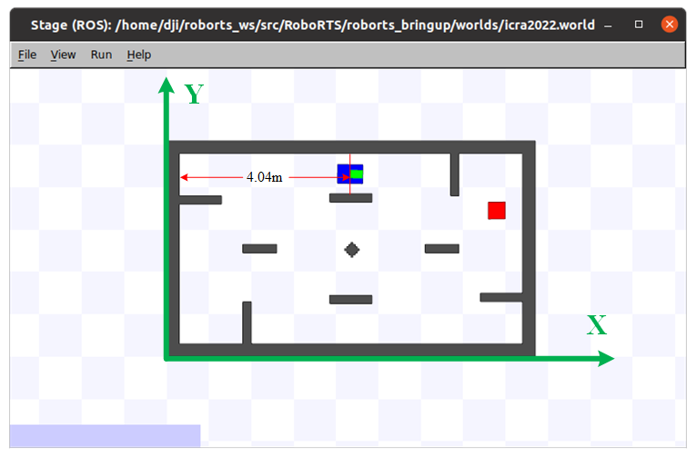
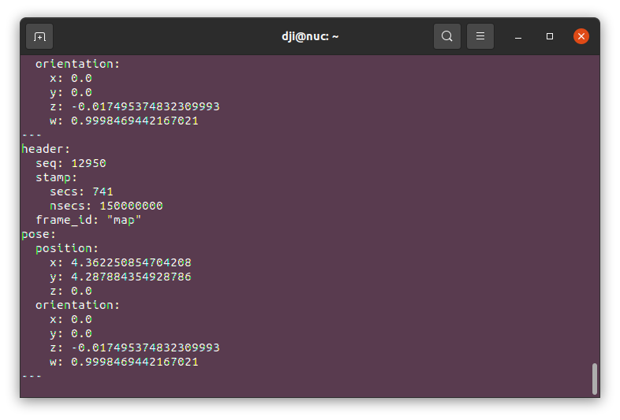
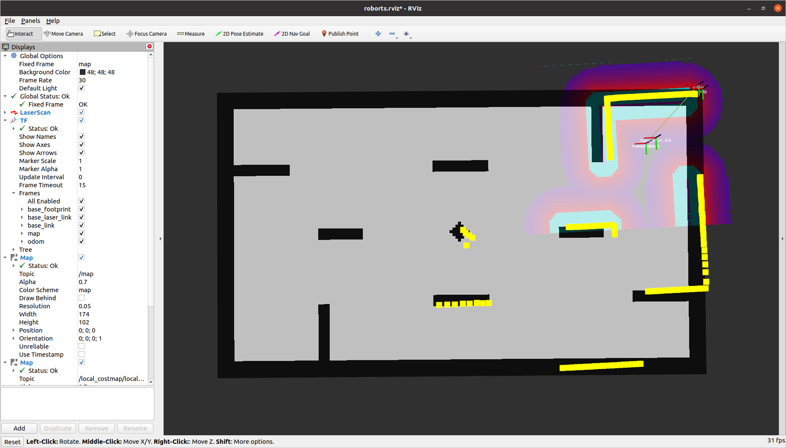

# RoboRTS For ROS Noetic

## 简介

此仓库是在[RoboRTS](https://github.com/RoboMaster/RoboRTS)开源代码的基础上进行修改，以提供ROS Noetic版本对RoboRTS的支持，方便后续在ubuntu20.04系统上进行二次开发。主要针对以下内容进行修改：

- 更新地图为最新（RMUA2022）规则中使用的地图。
- 更新world文件，增加了机器人头部标识，以方便使用stage调试。
- 更新`roborts_msgs`和`roborts_base`包为最新（RMUA2022）规则中使用的包。
- Fix了定位节点无法启动的问题。由于C++编译器原因，部分代码 (比如`amcl.cpp`, `teb_local_planner.cpp`等)中部分函数编写不规范导致。
- Fix了`OpenCV`库的问题。由于ROS Noetic自带OpenCV4，原始RoboRTS中使用OpenCV3，修改了`roborts_camera`包和`roborts_tracking`包中的部分OpenCV接口以支持OpenCV4。

## 说明

- 未同步队伍`RMUA2022`参赛代码

- 更新的地图文件是依据最新（RMUA2022）规则中公布的地图，按照 20:1 的比例制作，**包括四周宽度为30厘米的围栏**，定位的结果将是以围栏外围为坐标系，示意图如下所示：
  
  
- 在ROS Neotic中亦可以使用`OpenCV3`，按照以下步骤操作即可：

  - 安装依赖

    ~~~shell
    sudo apt-get install build-essential cmake git libgtk2.0-dev libgtk-3-dev pkg-config
    sudo apt-get install libavcodec-dev libavformat-dev libswscale-dev
    sudo apt-get install libjpeg-dev libpng-dev libtiff5-dev libdc1394-22-dev libeigen3-dev
    sudo apt-get install libtheora-dev libvorbis-dev libxvidcore-dev libx264-dev sphinx-common 
    sudo apt-get install libtbb-dev yasm libfaac-dev libopencore-amrnb-dev libopencore-amrwb-dev libopenexr-dev 
    sudo apt-get install libgstreamer-plugins-base1.0-dev libavutil-dev libavfilter-dev libavresample-dev
    ~~~

  - 官网（https://opencv.org/releases/）下载`OpenCV3`的`Sources`版本

    ~~~shell
    unzip opencv-3.4.*.zip
    cd opencv-3.4.*
    mkdir build 
    cd build
    cmake ..
    make -j4
    sudo make install
    ~~~

  - 找到`cv_bridge`配置文件所在位置

    ~~~shell
    cd /opt/ros/noetic/share/cv_bridge/cmake
    sudo gedit cv_bridgeConfig.cmake
    ~~~

  - 将90行左右的内容修改

    ~~~shell
    if(NOT "include;/usr/include/opencv4 " STREQUAL " ")
      set(cv_bridge_INCLUDE_DIRS "")
      set(_include_dirs "include;/usr/include/opencv4")
    ~~~

    修改为

    ~~~shell
    if(NOT "include;(/usr/local/include/opencv2) " STREQUAL " " )
      set(cv_brideg_INCLUDE_DIRS "")
      set(_include_dirs "include;(/usr/local/include/opencv2)") #()括号部分是你的OPENCV3的安装路径
    ~~~

  - 将指定库文件也修改为自己安装的opencv库文件

    ~~~shell
    set(libraries "cv_bridge;/usr/lib/x86_64-linux-gnu/libopencv_calib3d.so.4.2.0;/usr/lib/x86_64-linux-gnu/libopencv_dnn.so.4.2.0;/usr/lib/x86_64-linux-gnu/libopencv_features2d.so.4.2.0;/usr/lib/x86_64-linux-gnu/libopencv_flann.so.4.2.0;/usr/lib/x86_64-linux-gnu/libopencv_highgui.so.4.2.0;/usr/lib/x86_64-linux-gnu/libopencv_ml.so.4.2.0;/usr/lib/x86_64-linux-gnu/libopencv_objdetect.so.4.2.0;/usr/lib/x86_64-linux-gnu/libopencv_photo.so.4.2.0;/usr/lib/x86_64-linux-gnu/libopencv_stitching.so.4.2.0;/usr/lib/x86_64-linux-gnu/libopencv_video.so.4.2.0;/usr/lib/x86_64-linux-gnu/libopencv_videoio.so.4.2.0;/usr/lib/x86_64-linux-gnu/libopencv_aruco.so.4.2.0;/usr/lib/x86_64-linux-gnu/libopencv_bgsegm.so.4.2.0;/usr/lib/x86_64-linux-gnu/libopencv_bioinspired.so.4.2.0;/usr/lib/x86_64-linux-gnu/libopencv_ccalib.so.4.2.0;/usr/lib/x86_64-linux-gnu/libopencv_datasets.so.4.2.0;/usr/lib/x86_64-linux-gnu/libopencv_dnn_objdetect.so.4.2.0;/usr/lib/x86_64-linux-gnu/libopencv_dnn_superres.so.4.2.0;/usr/lib/x86_64-linux-gnu/libopencv_dpm.so.4.2.0;/usr/lib/x86_64-linux-gnu/libopencv_face.so.4.2.0;/usr/lib/x86_64-linux-gnu/libopencv_freetype.so.4.2.0;/usr/lib/x86_64-linux-gnu/libopencv_fuzzy.so.4.2.0;/usr/lib/x86_64-linux-gnu/libopencv_hdf.so.4.2.0;/usr/lib/x86_64-linux-gnu/libopencv_hfs.so.4.2.0;/usr/lib/x86_64-linux-gnu/libopencv_img_hash.so.4.2.0;/usr/lib/x86_64-linux-gnu/libopencv_line_descriptor.so.4.2.0;/usr/lib/x86_64-linux-gnu/libopencv_optflow.so.4.2.0;/usr/lib/x86_64-linux-gnu/libopencv_phase_unwrapping.so.4.2.0;/usr/lib/x86_64-linux-gnu/libopencv_plot.so.4.2.0;/usr/lib/x86_64-linux-gnu/libopencv_quality.so.4.2.0;/usr/lib/x86_64-linux-gnu/libopencv_reg.so.4.2.0;/usr/lib/x86_64-linux-gnu/libopencv_rgbd.so.4.2.0;/usr/lib/x86_64-linux-gnu/libopencv_saliency.so.4.2.0;/usr/lib/x86_64-linux-gnu/libopencv_shape.so.4.2.0;/usr/lib/x86_64-linux-gnu/libopencv_stereo.so.4.2.0;/usr/lib/x86_64-linux-gnu/libopencv_structured_light.so.4.2.0;/usr/lib/x86_64-linux-gnu/libopencv_superres.so.4.2.0;/usr/lib/x86_64-linux-gnu/libopencv_surface_matching.so.4.2.0;/usr/lib/x86_64-linux-gnu/libopencv_text.so.4.2.0;/usr/lib/x86_64-linux-gnu/libopencv_tracking.so.4.2.0;/usr/lib/x86_64-linux-gnu/libopencv_videostab.so.4.2.0;/usr/lib/x86_64-linux-gnu/libopencv_viz.so.4.2.0;/usr/lib/x86_64-linux-gnu/libopencv_ximgproc.so.4.2.0;/usr/lib/x86_64-linux-gnu/libopencv_xobjdetect.so.4.2.0;/usr/lib/x86_64-linux-gnu/libopencv_xphoto.so.4.2.0;/usr/lib/x86_64-linux-gnu/libopencv_core.so.4.2.0;/usr/lib/x86_64-linux-gnu/libopencv_imgproc.so.4.2.0;/usr/lib/x86_64-linux-gnu/libopencv_imgcodecs.so.4.2.0")
    
    ~~~

    修改为 (这里以`opencv-3.4.16`为例)：

    ~~~shell
    set(libraries "cv_bridge;/usr/local/lib/libopencv_calib3d.so;/usr/local/lib/libopencv_features2d.so.3.4.16;/usr/local/lib/libopencv_imgproc.so.3.4;/usr/local/lib/libopencv_shape.so;/usr/local/lib/libopencv_videoio.so.3.4.16;/usr/local/lib/libopencv_calib3d.so.3.4;/usr/local/lib/libopencv_flann.so;/usr/local/lib/libopencv_imgproc.so.3.4.16;/usr/local/lib/libopencv_shape.so.3.4;/usr/local/lib/libopencv_video.so;/usr/local/lib/libopencv_calib3d.so.3.4.16;/usr/local/lib/libopencv_flann.so.3.4;/usr/local/lib/libopencv_ml.so;/usr/local/lib/libopencv_shape.so.3.4.16;/usr/local/lib/libopencv_video.so.3.4;/usr/local/lib/libopencv_core.so;/usr/local/lib/libopencv_flann.so.3.4.16;/usr/local/lib/libopencv_ml.so.3.4;/usr/local/lib/libopencv_stitching.so;/usr/local/lib/libopencv_video.so.3.4.16;/usr/local/lib/libopencv_core.so.3.4;/usr/local/lib/libopencv_highgui.so;/usr/local/lib/libopencv_ml.so.3.4.16;/usr/local/lib/libopencv_stitching.so.3.4;/usr/local/lib/libopencv_videostab.so;/usr/local/lib/libopencv_core.so.3.4.16;/usr/local/lib/libopencv_highgui.so.3.4;/usr/local/lib/libopencv_objdetect.so;/usr/local/lib/libopencv_stitching.so.3.4.16;/usr/local/lib/libopencv_videostab.so.3.4;/usr/local/lib/libopencv_dnn.so;/usr/local/lib/libopencv_highgui.so.3.4.16;/usr/local/lib/libopencv_objdetect.so.3.4;/usr/local/lib/libopencv_superres.so;/usr/local/lib/libopencv_videostab.so.3.4.16;/usr/local/lib/libopencv_dnn.so.3.4;/usr/local/lib/libopencv_imgcodecs.so;/usr/local/lib/libopencv_objdetect.so.3.4.16;/usr/local/lib/libopencv_superres.so.3.4;/usr/local/lib/libopencv_viz.so;/usr/local/lib/libopencv_dnn.so;/usr/local/lib/libopencv_dnn.so.3.4.16;/usr/local/lib/libopencv_imgcodecs.so.3.4;/usr/local/lib/libopencv_photo.so;/usr/local/lib/libopencv_superres.so.3.4.16;/usr/local/lib/libopencv_viz.so.3.4;/usr/local/lib/libopencv_features2d.so;/usr/local/lib/libopencv_imgcodecs.so.3.4.16;/usr/local/lib/libopencv_photo.so.3.4;/usr/local/lib/libopencv_videoio.so;/usr/local/lib/libopencv_viz.so.3.4.16")
    
    ~~~

  - `CMakeLists`文件更改编译选项：

    ~~~shell
    find_package(OpenCV 3 REQUIRED)
    ~~~
    
 ## 编译运行
 - 编译
   ~~~shell
   mkdir -p ~/roborts_ws/src
   cd ~/roborts_ws/src
   git clone https://github.com/wzw1105/RoboRTS-Noetic.git --depth=1
   cd ..
   catkin_make
   echo "source ~/roborts_ws/devel/setup.bash" >> ~/.bashrc
   source ~/.bashrc
   ~~~
 - 运行
   ~~~shell
   roslaunch roborts_bringup roborts_stage.launch
   ~~~
   
 - 运行结果展示
  

    

    
